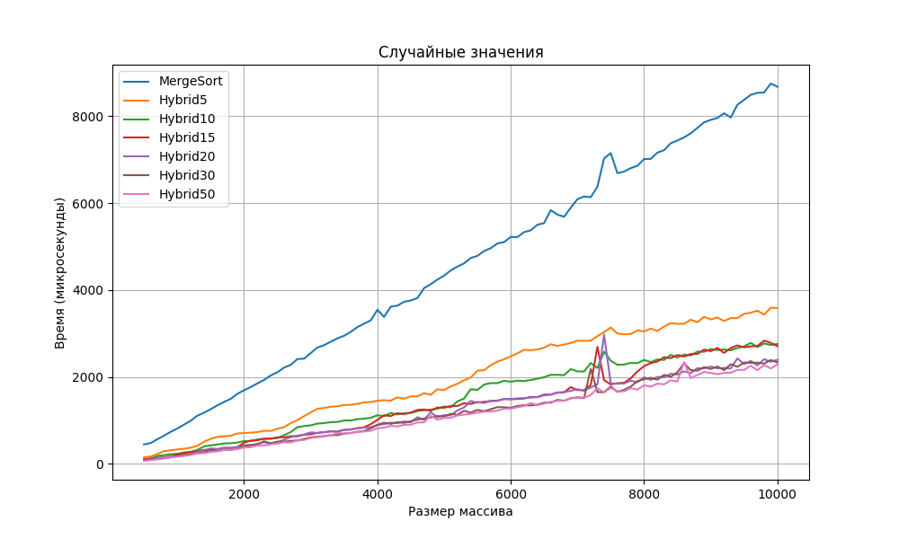
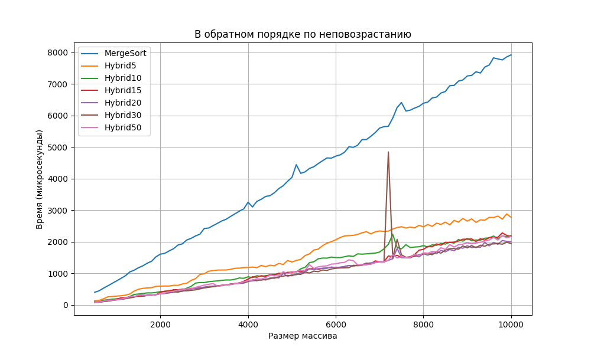
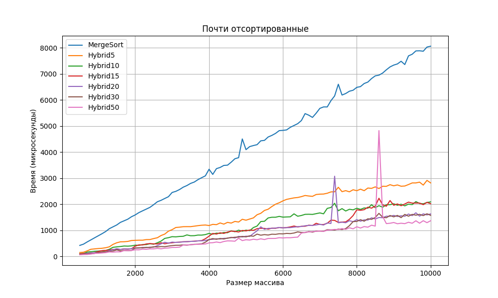

## Выводы по эмпирическому анализу Merge Sort и Hybrid Merge+Insertion Sort

В ходе выполнения работы было проведено экспериментальное исследование двух реализаций алгоритма сортировки слиянием: стандартной рекурсивной Merge Sort и гибридной Merge+Insertion Sort, переключающейся на сортировку вставками для малых подмассивов.  Были сгенерированы три категории тестовых данных: случайные массивы, обратно отсортированные массивы и "почти" отсортированные массивы. Размеры массивов варьировались от 500 до 10000 элементов с шагом 100. Для гибридного алгоритма были протестированы значения порога переключения (threshold) 5, 10, 15, 20, 30 и 50.  Результаты замеров времени выполнения алгоритмов (в микросекундах) усреднялись по 5 прогонам и сохранялись в CSV файлы для последующего анализа и визуализации.

### Основные наблюдения:

* Замеры на случайных значениях при разных значениях перехода

* Замеры на значениях в обратном порядке по невозрастанию при разных значениях перехода

* Замеры на почти отсортированных значениях при разных значениях перехода

Можем наблюдать, что показатели на случайных значениях немного больше, чем на остальных двух вне зависимости от реализации кода. Заметные изменения для гибридного алгоритма мы можем наблюдать при значениях от 1000 значений. На каждой из выборок мы можем наблюдать, что MergeSort проигрывает гибридной реализации.

### Выводы:

Гибридный алгоритм Merge+Insertion Sort  может  существенно  ускорить сортировку  на практике,  особенно  для  случайных  и  "почти"  отсортированных данных  небольшого  размера. Мы можем видеть, что гибридный алгоритм более стабилен в большинстве ситуаций.

### Другое
- [Реализация классов ArrayGenerator и SortTester](src/release.cpp)
- id посылки на codeforces: [292898982](https://dsahse.contest.codeforces.com/group/NOflOR1Qt0/contest/565612/submission/292898982)
- [публичный репозиторий](https://github.com/Gruz2520/monte_carlo_area) 

